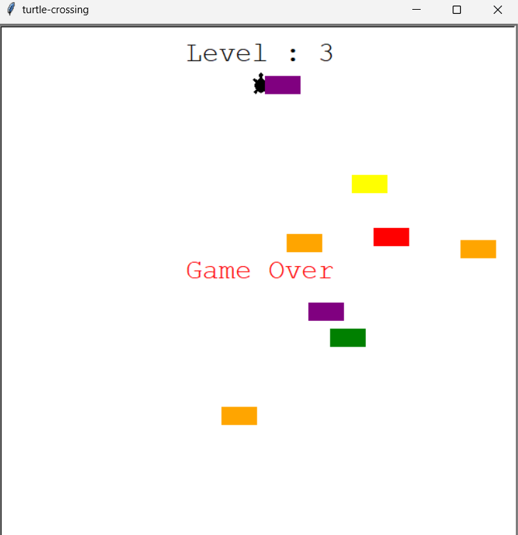

# Turtle Crossing Game

This repository contains the code for a simple Turtle Crossing game built using Python's `turtle` module. The objective of the game is to move the turtle from the bottom to the top of the screen while avoiding cars that move horizontally across the screen. Each time the turtle successfully crosses the road, the game level increases, and the cars move faster.

## screenshot


## Game Features

- **Player Movement**: Control the turtle using the "Up" arrow key to move it forward.
- **Car Obstacles**: Randomly generated cars move horizontally across the screen. The speed of the cars increases with each level.
- **Scoreboard**: The game displays the current level on the screen. When the turtle collides with a car, the game ends with a "Game Over" message.

## How to Play

1. Use the "Up" arrow key to move the turtle forward.
2. Avoid colliding with the cars moving across the screen.
3. Reach the top of the screen to advance to the next level.
4. The game ends if the turtle collides with a car.

## Installation

1. Clone the repository:
    ```bash
    git clone https://github.com/AdarshaRimal/Turtle-crossing-game.git
    ```
2. Navigate to the project directory:
    ```bash
    cd turtle-crossing-game
    ```
3. Run the game:
    ```bash
    python main.py
    ```

## Project Structure

- **`main.py`**: The main game loop, handling the gameplay and interactions.
- **`player.py`**: Contains the `Player` class, managing the turtle's movement.
- **`car_manager.py`**: Contains the `CarManager` class, responsible for car creation and movement.
- **`scoreboard.py`**: Contains the `Scoreboard` class, displaying the current level and handling the game-over screen.

## Requirements

- Python 3.x
- Turtle module (usually comes pre-installed with Python)

## License

This project is licensed under the MIT License. See the [LICENSE](LICENSE) file for details.

---

Enjoy playing the Turtle Crossing Game and test your skills in dodging cars!
